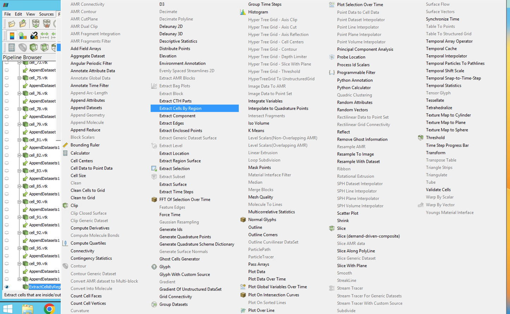
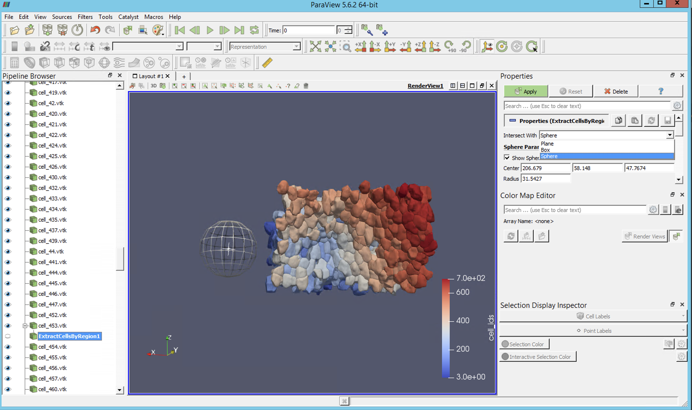
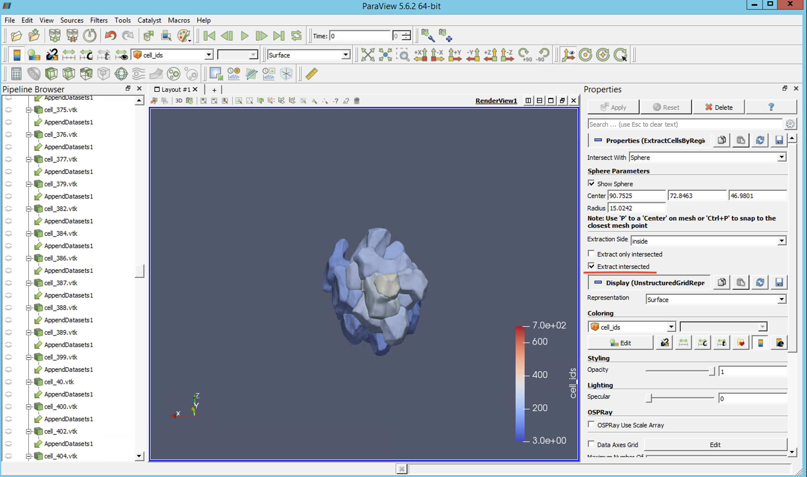
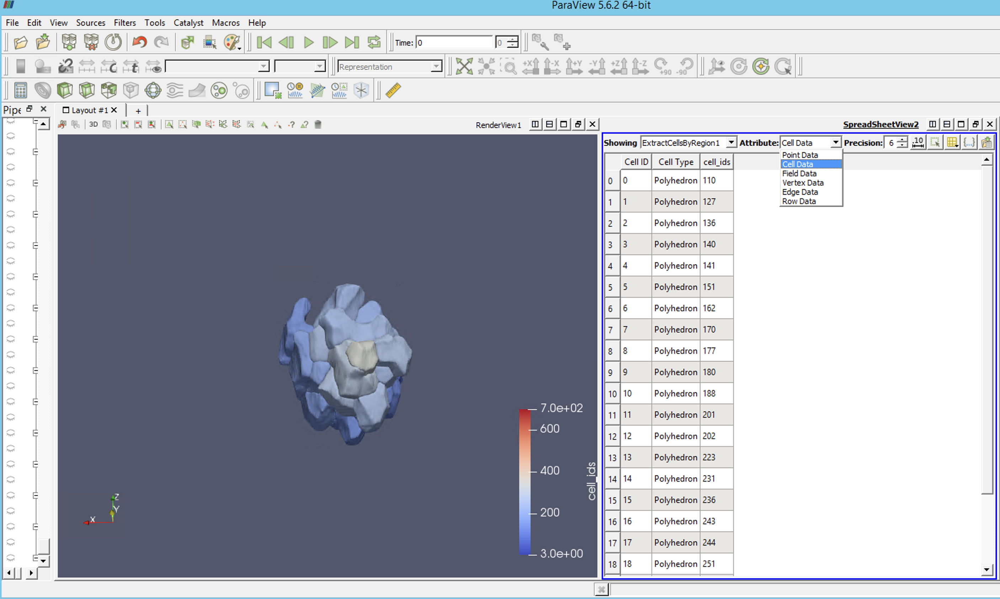
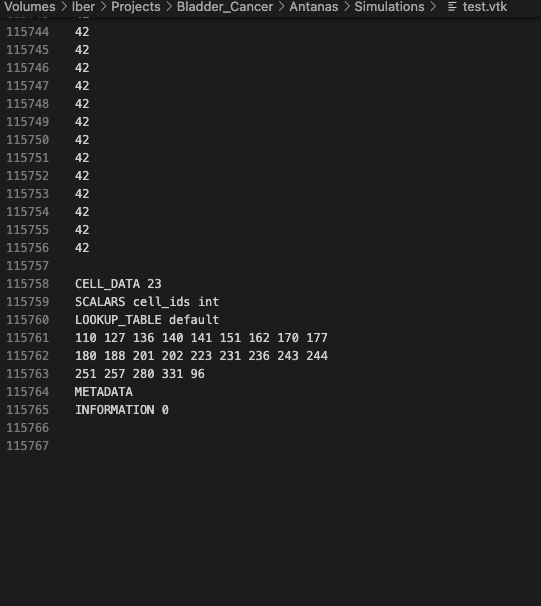

---

# Isolating a Patch of Cells for SimuCell3D

This guide will walk you through the process of isolating a patch of cells for use with the SimuCell3D cell simulation framework. We will be using the `extract_by_region` filter in ParaView, an open-source data analysis and visualization application.

## Prerequisites

Before you begin, you will need the following:

- ParaView installed on your machine. You can download it from [here](https://www.paraview.org/download/).
- A mesh file (.vtk or .stl format) representing your cell data.

- It may be a good idea to initially isolate cells that do not touch the borders before beggining this step. Refer to the notebook for isolation of the cells from a list of "filtered" labels.

- Ensure that the cells are converted to vtk format. The meshed cells have to have their label attached in the CELL_DATA section. To get this you may use Isolate_filter from MeshPrep.py. Altnernatively one may also use convert_to_vtk to meshes individually. 

## Steps

1. **Load your data into ParaView.**

   Open ParaView and load your mesh file using `File > Open`. Open all cells within the viewer (in vtk format). Append the dataset (Filters > Append Datasets -> Apply).

2. **Apply the `extract_by_region` filter.**

   With your mesh file selected in the Pipeline Browser, go to `Filters > Extract_by_region`. 
   
   This will open the `Extract by region` panel. In the panel, from the panel you dhould choose intersect with Sphere, and Extract intersected in the panel. Move the sphere to a region where you believe would result in a spherical sample, and Apply. You may look at the information panel to check how many cells the selection includes.
   
   Dilate or retract the sphere to change your selection and hit Apply. Repeat until you obtain a suitable sample.
   

3. **Lookup list of labels of cells.**

   To obtain the list of cells, one may simply split the view, and choose the Spread sheet View. There, choose "Attribute: Cell data", the cell_ids are in the column. 
   

   A fast way is just to export the clump of meshes as a vtk in ASCII and go to the very bottom of the file and copy the list from there.
   

